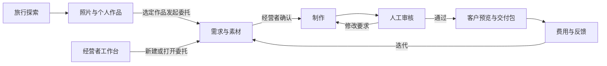

# 旅藏经营者视角：模块、职责与跳转设计

日期：2026-10-06。状态：核心经营者流程已实施；下文同时保留设计目标和 P1 后续范围，实际交付与验证见 `docs/operator-verification.md`。

## 1. 目的与范围

让一名或两名大学生经营者，借助现有 Agent 创作能力处理一份文创委托：收集需求和素材、确认理解、制作作品、人工审核、准备数字交付、记录成本和反馈。比赛展示以团队自测或真实试用委托为基础，不以成交作为验收前提。

首版默认交付数字纪念作品，可附三维模型。实体定制作为同一委托的可选分支，显示询价、切片、打样和人工核对状态。数字完成、文件导出、实际交付、付款、实体生产分别记录。

三天范围：经营者入口、委托列表、同一委托内的需求/制作/审核/交付流程、基本费用与处理记录。主题活动复用已有能力；新增宣传文案与跨委托复盘属于后续增强。

这次设计继承现有原生 HTML/CSS/JS 与 Node 服务，不更换框架。运行范围仍为同一浏览器来源、单台持久 Node 服务；经营者视角是本机工作入口，不是多账号权限系统。

## 2. 当前事实与复用依据

| 当前模块 | 已有能力 | 本次需要补的连接 |
| --- | --- | --- |
| `/travel.html` | 旅行对话、资料整理、路线、旧展柜、商家活动、预制纪念品需求和手录报价 | 改为清楚的经营者入口；活动仍归经营者维护 |
| `/collection.html`，实际渲染模块 `travel-gallery.js` | 主画布/时间轴/地图、合集、单件和逐张故事、真实 GLB、生成、导出 | 从指定合集/作品发起委托；带委托编号进入创作后返回 |
| `travel-keepsake-store.js` | IndexedDB `lvzang-keepsakes`，作品/回忆/照片/定制需求/meta | 委托关联这些现有资料；保留旧记录与校验 |
| `travel-state.js` | localStorage `lvzang.v1`，旧旅行、活动、预制需求与报价 | 旧需求可一次性转为委托，不覆盖旧数据 |
| `collection-generation.js`、`collection-jobs.js` | 生成进度、模型和参考图、报告、继续领取、失败恢复 | 让委托引用任务和结果，复用同一远端任务编号 |
| 原拾光创作入口 `/` | 单件设计、参考图确认、视觉回看、三维与导出 | 为需要逐步确认的单件制作提供接入点 |
| 当前备份/ZIP | 本机完整收藏备份、生成任务文件集合 | 新增按本委托筛选的交付包，不能直接导出所有收藏 |

核查日期为 2026-10-06。最新图库真实路由为 `#world/...`；旧 `#collection/...` 仅属于旧入口，新增按钮按最新路由接入。`travel-gallery.js` 会重新生成页头，经营入口应修改实际渲染模块，不能只改静态 HTML。

## 3. 方案选择

| 方案 | 优点 | 代价与取舍 |
| --- | --- | --- |
| 在现有商家区域堆叠制作控件 | 入口现成 | 与旅行对话共用大文件；个人作品和委托关系难表达 |
| 独立轻量经营者页面，引用现有作品和生成能力（选定） | 一个工作入口，委托上下文清楚，减少对旅行页面的影响 | 需要补入口、委托存储和往返上下文 |
| 完整商家平台 | 可覆盖多账号交易 | 三天范围无法覆盖账户、支付、远程收单与履约，留到业务验证后 |

选定新经营者页面 `/operator.html`。它只有委托工作台和作品选择两个核心界面；需求、制作、审核、交付和费用是同一委托详情内的步骤，不各建一套独立后台。

## 4. 角色与产品入口

| 角色 | 来产品做什么 | 负责什么 | 不应混淆的事实 |
| --- | --- | --- | --- |
| 游客/委托人 | 提供素材与要求、浏览和确认作品 | 确认个人事实、设计效果和最终交付内容 | 本机体验不等于远程提交或付款 |
| 经营者 | 接待、组织制作、审核、报价与交付 | 确认承诺、费用、质量和完成状态 | Agent 不能替经营者承诺实物质量或交期 |
| Agent | 整理需求、辅助设计、调用工具、解释检查、整理交付说明 | 给出有依据的结构化成果和待确认项 | 每项输出必须来自本委托资料及实际执行结果 |
| 制作供应方 | 可选的实体报价、切片、打样与生产 | 提供实际价格、工艺与样品结果 | 首版经营者手动记录，产品未自动联系供应方 |

全局入口文案统一为“经营者工作台”。从旅行页旧“商家工作台”、收藏主画布页头、合集/单件详情均能进入。游客正常浏览时不展示经营成本、客户备注和经营记录。

进入经营者页首屏显示“本机工作台 · 数据保存在当前浏览器”。新建委托默认来源为“团队自测”，可改为“真实试用”或“真实业务”；后两项由经营者选择并补充来源说明，不由 AI 判断。示例数据单独标注“演示”，不进入真实试用或业务统计。

## 5. 模块职责总表

| 编号与模块 | 展示/处理内容 | Agent 职责 | 人工职责 | 主操作及去向 | 优先级 |
| --- | --- | --- | --- | --- | --- |
| M0 旅行探索 | 主题、路线、地点资料 | 复用现有旅行 Agent | 核对未确认地点信息 | “保存方案去创作”到现有创作页；“经营者工作台”到 M2 | 已有，补入口 |
| M1 收藏与作品详情 | 个人照片/故事、合集、模型、来源、检查报告 | 复用现有策展和制作 | 选择要委托或复用的作品 | “提交定制需求”/“作为委托处理”到 M3，带指定作品 | P0 |
| M2 委托工作台 | 委托列表、待处理项、来源标签、负责人 | 可依据实际状态解释待处理事项，不编造进度 | 新建、选择、分配和归档 | “新建委托”到 M3；列表项到对应委托当前步骤 | P0 |
| M3 需求与素材 | 客户称呼、原始要求、照片、主题、交付范围、时间 | 生成需求摘要、缺口和可选建议 | 确认需求，指定本次制作素材和产物 | “确认需求，去制作”到 M4 | P0 |
| M4 制作 | 参考图/模型、实际任务阶段、已选版本 | 复用设计、生图、回看和三维；按阶段触发 | 确认参考图、选择三维或重绘、保留版本 | “提交审核”到 M5；“打开创作”到现有创作入口 | P0 |
| M5 审核 | 原照片与作品对照、来源、视觉回看、数字文件和打印报告 | 汇总已有检查、列出风险和缺口 | 接受、退回并写修改要求；确认交付类型 | “退回修改”到 M4；“审核通过”到 M6 | P0 |
| M6 交付 | 本委托文件清单、客户预览、使用说明、导出版本 | 生成可编辑的作品/交付说明，文件清单由程序核对 | 选文件、核对、导出，记录实际交付反馈 | “导出交付包”；“查看客户预览”；“记录反馈” | P0 |
| M7 费用与复盘 | 实际/估算费用、报价、人工时间、失败与反馈 | 可解释已录数据；计算交给程序 | 录入费用依据、处理时间、反馈 | 当前委托内查看；“根据反馈修改”到 M3/M4 | P0 基础记录 |
| M8 主题活动与推广 | 已有主题活动、可授权使用的样品和介绍 | 后续辅助整理推广文案 | 核对素材和内容、手动发布 | 首版进入现有活动管理；后续从获授权成品生成文案 | 已有复用/P1 |

M7 是委托详情侧栏/折叠区，不额外建财务系统。M8 不作为交付必须经过的步骤，宣传发布需要经营者执行。

## 6. 核心导航与布局

经营者首屏不显示大型营收图表。页面顶部为标题、范围提示、“新建委托”；主体左侧是委托列表，右侧是选中委托，空状态说明三个起点：新建素材委托、从已有作品建立委托、导入旧定制需求。

桌面详情：上方固定委托名称、来源标签、状态、负责人和“返回来源”；主区按“需求 → 制作 → 审核 → 交付”组织。制作/审核时中间是作品和原图对照，右侧是下一项待办、处理记录和折叠的费用。一次只强调一个主要下一步。

委托列表只显示：名称、称呼/来源、状态、负责人、更新日期、下一项待办。小团队负责人为“我/队友/未分配”的本机标签；不是远程账号或实时协作。

手机先显示委托列表；进入详情后按同样步骤纵向排列。作品与关键操作先出现，日志和费用可展开。使用可点击的步骤导航、真实按钮、文字状态与键盘焦点；状态不只靠颜色区分。沿用旅藏现有字体、图标和控件语言，工作区用清楚的浅色背景，真实作品承担视觉重点。

## 7. 各步骤的内容与操作

### M3 需求与素材

最少必填：委托名称、来源类型、交付类型、至少一份可用素材（照片或已有作品）。客户称呼、故事、日期、期望时间、预算和备注选填。联系人、收货地址本版不作为必填。

交付类型：数字图像、数字 3D 作品、实体意向。默认数字 3D；也可只交图像，不强迫建模。实体意向须先明确尺寸、材料、数量，并在交付前记录真实制作验证情况。

经营者点击“整理需求”才调用文字/视觉能力；AI 输出：确认事项、未知事项、建议交付范围、最多两项关键补充问题。原始要求单独保留；建议不自动写成客户事实。经营者修改摘要并点击“确认需求”后，保存当前需求版本。

素材选择明确到照片与作品：默认不把整个个人收藏放入委托。入口来自已有作品时只关联选中作品，其余内容由人补选。双击或刷新不能重复创建同一来源需求的委托。

### M4 制作

显示来源素材、确认的需求、参考图、模型、实际阶段、生成任务编号的可展开记录，以及本次选中的交付版本。

主线默认先制作参考图，经营者看过并确认后再进入三维。沿用现有单件半自动能力；合集一键制作可作为显式可选入口，须说明它会继续调用三维及相关服务。点击开始后才生成，不因进入页面、切换步骤或点击预览自动付费。

三天最低接入采用“带委托上下文打开现有创作页”：委托编号、选中素材、需求版本先保存，再进入创作页。生成成功时关联返回的作品/任务，显示“返回委托”。将来可以把预览嵌入经营页，但不复制第二套生成引擎。

已完成模型可以直接选用，不能因建立委托而再次生成。失败保留原成果；已有远端任务优先继续领取；提交结果不明进入“需核对任务”，禁止自动新提交。经营者明确点击重绘/重试，才可能产生新增调用。

### M5 审核

核对表分为三类：

- 内容：人物/主体、故事、地点与所选原素材对应；来源不明时待人工确认。
- 数字：本次选定文件实际存在，模型预览及下载可用；图像可以独立成为交付物。
- 实体：已有几何检查、尺寸、材料；另外记录切片/试打状态。软件检查通过只意味着已有检查项通过。

Agent 读取实际回看和报告生成摘要，不能凭文字“通过”覆盖程序失败项。经营者填写处理结论与理由；退回时必须指出修改内容，并回到同一委托 M4。

数字与实体审核分开：打印失败的 GLB 若可展示、可下载且内容已确认，仍可作为数字作品交付，但交付说明保留打印限制。实体未试打就显示“实体尚待验证”，不能变成“实体成品可交付”。

审核记录绑定需求版本和所选作品版本。改需求、换参考图、换模型或改交付规格，原审核与旧交付包仍可查看，但新版本回到待审核，不沿用“通过”。仅修改客户称呼或备注不必重做作品审核。

### M6 交付

客户预览是当前选中委托的只读本机预览：作品、选定故事、交付内容和必要限制。隐藏成本、内部备注、委托列表、供应商信息及其他作品。它不是可外网访问的客户链接；跨设备通过实际导出文件交付。

交付前先显示文件清单和缺失项。默认包包含：

- 选定参考图/成品图；选定 GLB（仅数字 3D 委托）。
- 作品说明、版本和交付日期、文件清单。
- 与本次交付有关的使用/打印限制和必要检查摘要。

原照片默认不加入，经营者主动选择才打包。经营成本和内部备忘不加入客户包。STL/3MF 仅在已有对应导出能力和检查条件满足时可选；不凭 GLB 文件名转换假装完成。

ZIP 仅收集本委托选定资产；生成任务导出接口若包含其他资产，应在经营页按清单筛选。现有“导出合集”实际调用完整收藏备份，不可直接复用为客户交付按钮。所有必选文件成功打包后才显示“已导出”；中途失败保留状态并明确缺少哪一项。

“记录已交付”是独立人工操作，填写时间和方式；“客户已确认”再独立记录反馈及依据。导出不自动变成客户确认、付款或发货。旧交付包以版本留存，重新审核后的新包覆盖当前选择，不删除旧记录。

### M7 费用与反馈

本委托保留三组基础记录：

- 程序记录：实际任务阶段、发起次数、等待时间、失败/恢复；继续轮询不算新生成，无法确认提交是否成功时标为未知。
- 人工记录：累计主动处理分钟数、实际 API 费用及依据、实体询价/材料/后处理/运费、报价与交付反馈。等待模型的时间与人工时间分开。
- 系统计算：已录费用合计、已记录人工时间。若录了售价，可显示“售价减已录费用”，并注明尚未计入的项目；没有实际收费记录就不显示营收。

每笔费用标记“实际/估算/待补”。模型未知的费用、未知生产报价不补零。不同性质不混成一个“实际成本”。程序不替代服务商账单。

反馈记录“满意项、问题、是否愿意继续定制、修改要求”。若需要修改，回到同一委托需求/制作，保留旧版本。团队自测和试用数据单独标注；不将样例用于声称真实客户转化率。

### M8 活动与推广

旧商家页已有主题活动管理，首版保留入口，在经营者导航的次级区域访问。活动提供游客端主题入口，不参与每份委托的审核与交付。

后续“整理推广文案”从已确认的、允许展示的作品生成：产品介绍、服务范围和样品说明。人物照片/故事是否允许展示由人确认；没有用户授权的委托不自动成为公共样品。AI 只准备文案，不自动发布到外部平台，不生成销量或客户评价。

## 8. 跳转表：入口、上下文与返回

下列 `/operator.html` 路由和带委托参数的接入均为设计中的新增功能。`cid` 表示本机委托编号；`tripId`、`assetId` 是已有合集/作品编号。路径中的内容需要编码。

| 从哪里 | 按钮 | 到哪里 | 必须保留/传入 | 返回规则 |
| --- | --- | --- | --- | --- |
| 旅行探索页 | 经营者工作台 | `/operator.html#commissions` | 原页面位置 | 返回旅行探索 |
| 收藏主画布 | 经营者工作台 | `/operator.html#commissions` | 原视图与画布位置 | 返回原画布视图 |
| 合集详情 | 作为委托处理 | `/operator.html#new` | 指定合集编号，待选择作品，不默认全选 | 取消返回原合集 |
| 单件/照片详情 | 提交定制需求 | `/operator.html#new` | 来源照片、指定作品及来源页面 | 保存后到新委托需求；取消返回原详情 |
| 工作台 | 新建委托 | `/operator.html#new` | 空草稿或已保存草稿 | 返回列表；未保存时先保存/放弃 |
| 新建委托 | 从作品库选择 | `/operator.html#library` | 当前草稿编号，单件/多件选择范围 | 确认后回到原草稿，不新建第二份委托 |
| 旧定制需求 | 转为委托 | `/operator.html#commission/{cid}/brief` | 旧来源 ID、规格、报价 | 同一旧需求再次点击打开已有委托 |
| 列表项 | 打开/继续处理 | `/operator.html#commission/{cid}/{step}` | 委托编号及当前有效步骤 | 返回列表保留筛选与选中行 |
| 需求确认 | 确认需求，去制作 | `…/{cid}/make` | 保存的需求版本、已选素材 | 可回需求修改，修改会使旧审核失效 |
| 制作 | 打开单件创作 | 原拾光创作入口，新增委托上下文接入 | 委托/需求版本/照片/故事；启动前持久保存 | 页面显式“返回委托”，结果绑定同一委托 |
| 制作 | 制作旅行合集 | `/collection.html#world/create`，新增委托上下文接入 | 同上；选择的照片和输出数量 | 回 `…/{cid}/make`，不复制生成任务 |
| 制作 | 查看来源/已有模型 | `/collection.html#world/trip/{tripId}/{assetId}` | 委托返回上下文 | “返回委托”回原步骤；浏览不触发生成 |
| 制作 | 提交审核 | `…/{cid}/review` | 当前选定参考图/模型版本和报告 | 未齐全时停留制作并列出缺口 |
| 审核 | 退回修改 | `…/{cid}/make` | 修改理由、当前版本 | 旧版本保留，完成后重新审核 |
| 审核通过 | 去交付 | `…/{cid}/delivery` | 审核通过的具体版本与交付类型 | 换版本必须回审核 |
| 交付 | 查看客户预览 | `…/{cid}/preview` | 仅选定作品和客户展示字段 | 回交付，不显示内部经营资料 |
| 交付 | 查看费用/反馈 | 当前详情展开记录区 | 当前委托 | 收起仍在同一步骤 |
| 工作台次级入口 | 主题活动 | 现有旅行页商家活动区域（补直达） | 返回经营者上下文 | 回工作台列表 |

现有合集路由依据：主画布 `#world/canvas`，时间轴 `#world/timeline`，地图 `#world/map`，合集 `#world/trip/{tripId}`，单件 `#world/trip/{tripId}/{assetId}`，照片 `#world/trip/{tripId}/photo/{photoId}`，创作 `#world/create`。

返回目的地只能由程序选定上述内部路由，不能接受任意外部跳转地址。URL 只带编号和页面位置，不放照片、客户备注或完整需求。跨页面资料靠已保存的委托读取；临时 sessionStorage 只辅助预填，不作为唯一记录。

## 9. 状态与可用按钮

委托主状态只用六种：待完善、待制作、制作中、待审核、待交付、已交付；可归档。来源标签、自测/试用/业务属性、生成任务状态、审核结果、导出事件和付款情况分别保存，避免一个状态承担全部含义。

| 当前条件 | 主状态/提示 | 可进行 | 不能自动发生 |
| --- | --- | --- | --- |
| 缺素材或未确认需求 | 待完善 | 整理、补充、确认需求 | 付费生成 |
| 需求确认，已有作品或准备生成 | 待制作 | 选择作品、开始制作 | 页面加载后自动建模 |
| 任务正在执行 | 制作中 | 查看、停止后续阶段、继续领取 | 重复提交同一任务 |
| 任务失败或结果不明 | 待制作 + 失败/需核对提示 | 保留结果、恢复、明确重试 | 隐藏失败并显示完成 |
| 选定交付物齐全 | 待审核 | 人工审核、退回 | 模型生成完成就审核通过 |
| 审核通过且版本一致 | 待交付 | 客户预览、导出、手工记录交付 | 导出就算成交 |
| 已人工记录交付 | 已交付 | 反馈、归档、再次修改 | 自动声称客户满意 |

“已导出”是待交付/已交付中的文件事件；“需返工”是审核结果和待办，并回待制作。费用不完整不阻止数字文件交付，但显示待补记录。实体成品未完成验证或供应方确认时，只能交付数字稿/打样资料，不记成实体成品已交付。

## 10. 资料关联与一致性

产品只新增一份委托记录，不复制整个收藏模型。记录最少包含：编号、来源类型/来源需求编号、名称与客户称呼、负责人、原始要求、确认摘要与需求版本、选中照片/作品编号、生成任务编号、当前选中作品版本、审核结论、交付包记录、费用、人工时间、反馈和创建/修改时间。

照片与模型继续存现有位置，委托保存引用。引用缺失时显示“来源文件未找到”，提供重新选择/恢复路径，不重新生成代替原文件。

首版复用 `lvzang-keepsakes` 的 `meta` 存委托（每个委托一条），避免为一个流程升级整个数据库。所有经营模块通过同一薄存取模块读取，不让页面各维护一份重复委托数组。添加保存版本检查，防止多标签页旧记录覆盖新记录。

旧来源需求用稳定来源键关联委托；转换时原记录保留，后续处理只在委托中更新。选定作品、需求摘要及规格保存后才能启动工具；拿到任务编号立即保存。回调只更新所属委托及对应版本，不能因用户切换委托写到当前屏幕上的另一单。

经营者备份与客户交付分开：经营备份包含委托及其所引用的素材/文件和内部记录，并能恢复关联；客户包只含清单中选定的交付内容。旧收藏备份保持可读取；备份导入不得静默覆盖现有同编号、不同内容的数据。

## 11. Agent 调用边界

复用 DeepSeek 现有服务端能力，仅按动作调用：整理需求、实际设计/回看、按已有报告整理审核摘要、整理交付说明。不同职责可以是同一服务的不同提示与结构化输出；不为展示数量新增多个自动串行调用。

新摘要服务可以统一处理需求/审核/交付三种动作，复用已有错误处理与 JSON 校验；三种输入仍分别受约束。审核输入必须包含实际报告，交付说明输入必须来自程序核对后的文件清单。API 密钥仍在服务端。

无密钥/失败时保留草稿、原作品与已确认内容，允许经营者手动填写需求和说明。界面写明“人工填写”或“AI 整理”，不偷偷用规则结果冒充 AI。记录显示真实开始/结束/失败阶段；不新增虚假的百分比或完成动画。

## 12. 异常与边界体验

| 情形 | 用户看到什么 | 恢复办法 |
| --- | --- | --- |
| 没有委托 | 三种开始方式和“新建委托” | 不预填假营收 |
| 示例/团队自测 | 每个列表项和预览明确标签 | 示例不进入正式统计 |
| 存储失败 | “尚未保存”，保留当前输入 | 重试或导出草稿；不能跳走丢资料 |
| 未保存离开 | 保存草稿/放弃/继续编辑 | 确认后跳转 |
| 源作品被删除 | 缺失项目和原编号 | 从备份恢复或人工重新选作品 |
| 生成失败/提交不明 | 上一次成果及实际错误 | 继续领取/核对任务编号，按既有恢复逻辑处理 |
| 切换委托时旧任务返回 | 旧委托更新，当前页保持不变 | 回旧委托可看结果 |
| 内容审核退回 | 修改要求和上一版本 | 回制作，改完再审 |
| 打印检查失败 | 数字预览保留，实体限制可见 | 数字交付或人工调整；不放行失败打印导出 |
| 导出缺文件/下载失败 | 清单标明缺口，状态不变 | 补齐/重新下载，不强制重新生成 |
| 多标签页旧保存 | 提醒记录已更新，当前文字仍保留 | 查看新记录再保存 |

## 13. 三天内的范围与职责

以下是实现切分建议，时间以实际开发进度为准；本文件交付设计，不表示已完成实现。

| 批次 | A：界面与作品体验 | B：数据、Agent 与服务 | 联调成果 |
| --- | --- | --- | --- |
| 第一天 | 经营入口、委托列表/详情、需求表单、作品选择 | 委托保存/版本、旧来源转换、需求摘要 | 指定个人作品能进入一份可恢复的委托 |
| 第二天 | 制作跳转/返回、原图与结果对照、审核操作 | 关联现有任务和版本、审核记录与失效规则 | 同一委托能从素材完成制作并审核 |
| 第三天 | 客户预览、交付清单、费用/反馈、录屏 | 筛选 ZIP、交付事件、备份恢复、关键回归 | 一份真实素材案例可交付并解释小团队分工 |

最小验收范围优先支持一份委托交一件数字作品；已有合集可以选择其中作品，不强制生成三件。第一条链路完整后再扩展同单多件，不以半完成多件流程替代完整单件。

P0：M1 入口、M2-M6、M7 手录基础记录、返回上下文、错误恢复、客户包/经营备份区分。

P1：推广文案、通用主题模板、跨委托图表、更丰富供应商管理、多人远程协作、支付/物流。已有主题活动和报价功能可继续访问，首版不重写。

## 14. 对开发者的改动边界

预计新增：`public/operator.html`、对应 CSS、经营者 UI 模块、薄的委托存取/校验模块。命名以实现时与队友约定为准。

需要接入：`travel-gallery.js` 实际页头/作品按钮；`travel.js` 与 `travel.html` 的经营入口/旧需求转换；现有创作入口的委托预填与结果绑定；ZIP 打包与备份模块；`server.js` 静态白名单及摘要接口。

复用：`collection-generation.js` 的任务和结果访问、`collection-jobs.js` 的持久任务及恢复、现有预览与模型导出、`fflate`、现有 DeepSeek 服务端配置。

禁止为本次流程重新写一套生成/打印检查引擎。公共文件与接口由两人先约定修改边界；A 主导现有 `travel.js` 界面接入，B 提供独立接口及委托存取约定，避免同时大改同一文件。

## 15. 必须通过的验收场景

1. 从某一真实个人作品建立委托；原照片、故事和模型关联正确，刷新后可继续。
2. 新素材委托先保存、确认需求，再发起制作；浏览或返回不触发付费生成。
3. 生成的每个结果归属正确委托；切换页面/刷新不产生重复任务。
4. 审核能看到原素材、作品和实际报告；退回原因能带回制作。
5. 修改需求/作品版本后旧通过记录不再适用于新版本。
6. 打印失败的数字作品可展示限制；实体交付条件未满足不能标为成品已交付。
7. 客户预览只显示该委托；交付包不含其他作品、经营费用或默认未选的原照片。
8. ZIP 文件缺失/失败时不显示已导出；导出成功不自动记录成交、付款或客户确认。
9. 实际/估算费用与人工/等待时间明确区分；试用、自测、示例统计不混入真实业务。
10. 返回列表保留筛选；返回合集保留浏览位置；手机可完成选择、审核和导出。
11. 多标签页冲突、存储失败、旧需求重复转换和来源缺失有清楚的恢复行为。
12. 经营备份在干净浏览器来源恢复后，委托引用的照片/模型可读取，旧个人收藏不被破坏。

验收使用已有测试体系及完整场景验证；外部接口替身验证与真实模型调用分开记录。软件通过不作为市场、打印或成交证明。

## 16. 比赛演示路径

样例：“毕业旅行数字纪念物”，用本人或获得许可的真实照片。来源选“团队自测”或实际“真实试用”，费用未知就待补。展示既有模型时说明是已生成结果。

演示顺序：经营者工作台新建/打开委托 → 原始需求与 Agent 摘要 → 确认素材 → 制作记录与真实参考图/模型 → 原图对照审核 → 客户预览 → 导出选定文件 → 费用和人工时间记录 → 反馈/修改。

现场生成未结束时展示真实阶段与保存能力，再切换已有案例查看完成结果，明确它属于另一份已完成案例，不把其文件冒充本轮即时生成。

OPC 表述对应实际证据：少量人员负责接待与审核，Agent 承担可核查的策划/制作工作，现有工具串成可复用交付流程，成本和人工时间可以记录，反馈能回到同一委托持续修改。产品界面不声称尚未验证的提效比例、盈利或销售数据。

## 17. 设计自检

模块职责、正常/失败/返回跳转、来源与版本、数字/实体审核、导出/实际交付的边界均已指定。经营者视角覆盖个人合集，旧预制需求可接入；现有旅行探索和收藏浏览继续独立使用。

实现风险集中在创作上下文与结果绑定、交付资产筛选、数据恢复三处；应优先验证。三天交付以一份委托的一件数字作品完整走通为最小标准。远程收单和支付不作为本设计已解决的问题。
